# [apas]()

Automated programming assessment system is an online judge system that supports assignment management, automatic grading, plagiarism check etc.
It was built with the following tech stack:
* Django
* MySQL/SqlLite
* Angular JS
* GCC Compiler

## Example Use Flow

1. Staff Login

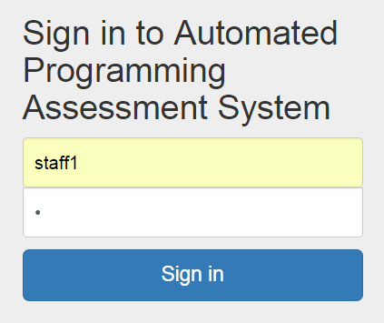

2. Create questions

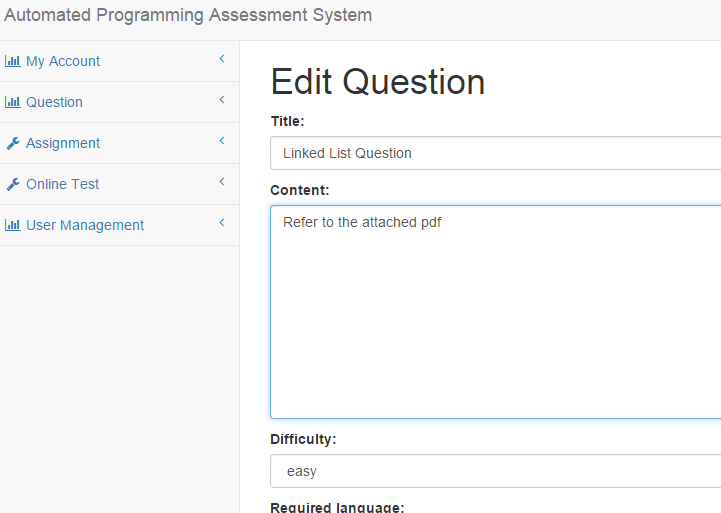

3. Configure test cases

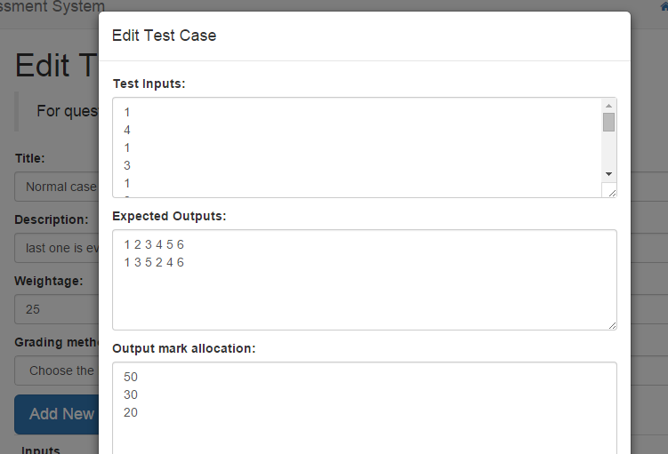

4. Create assignment with the questions

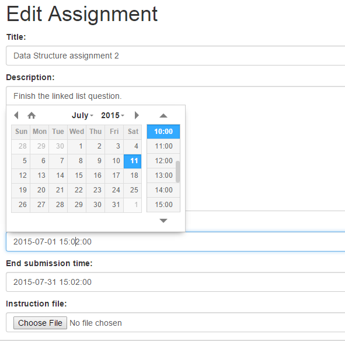

5. Students Login

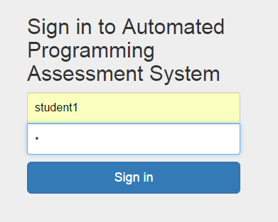

6. Students see assignments

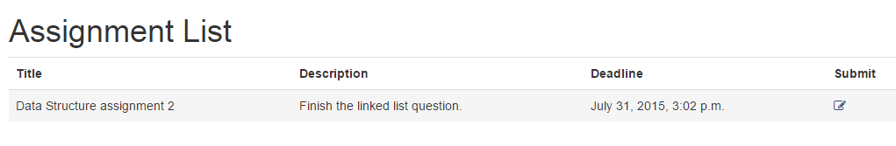

7. Students write code to finish assignment

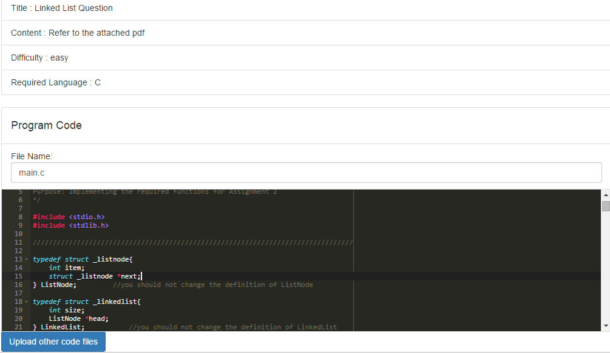

8. Staff Login, then trigger assignment grading

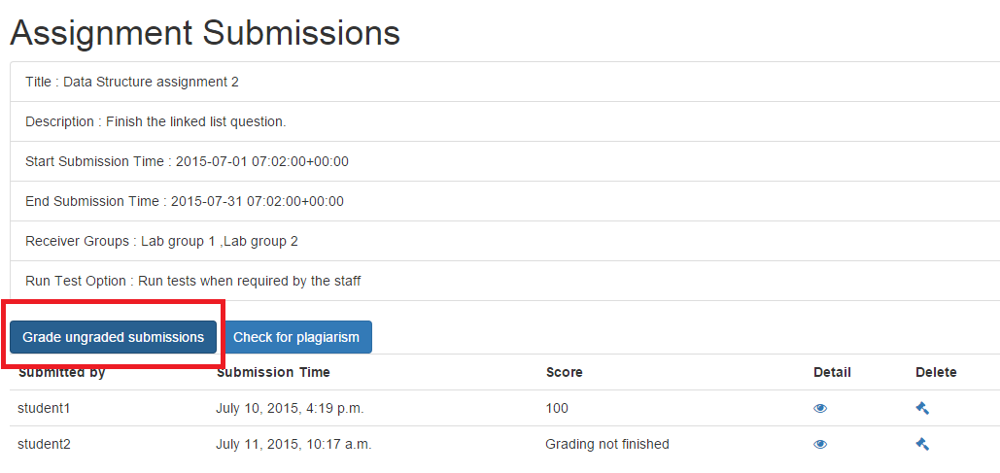

9. Both staff and students will then see their score, and test results

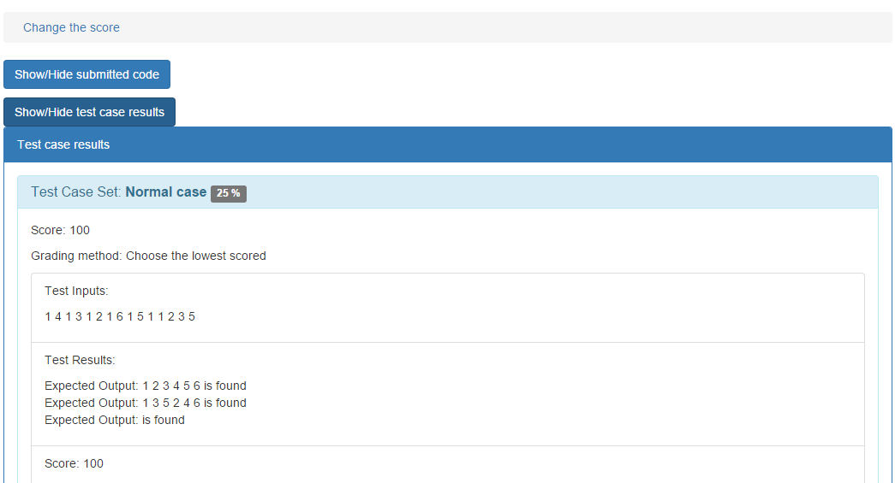

10. Staff can start plagiarism check

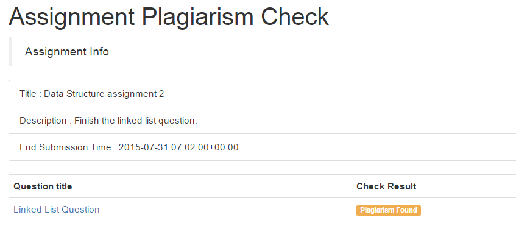

11. Plagiarism checking result is shown

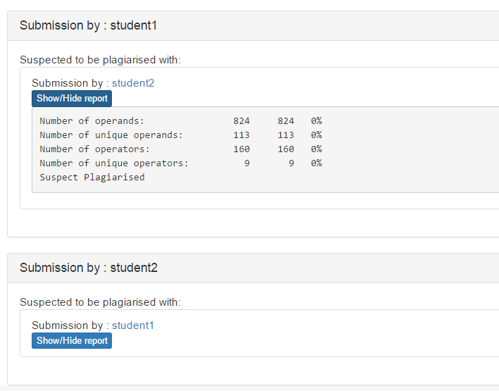
